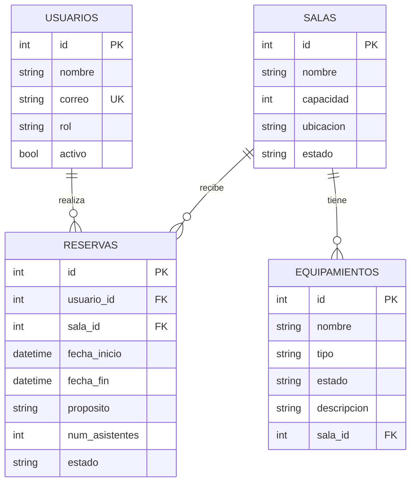

# Diagrama de datos

```mermaid
erDiagram
    USUARIOS ||--o{ RESERVAS : realiza
    SALAS ||--o{ RESERVAS : recibe
    SALAS ||--o{ EQUIPAMIENTOS : tiene

    USUARIOS {
        int id PK
        string nombre
        string correo UK
        string rol
        bool activo
    }
    SALAS {
        int id PK
        string nombre
        int capacidad
        string ubicacion
        string estado
    }
    EQUIPAMIENTOS {
        int id PK
        string nombre
        string tipo
        string estado
        string descripcion
        int sala_id FK
    }
    RESERVAS {
        int id PK
        int usuario_id FK
        int sala_id FK
        datetime fecha_inicio
        datetime fecha_fin
        string proposito
        int num_asistentes
        string estado
    }
```
